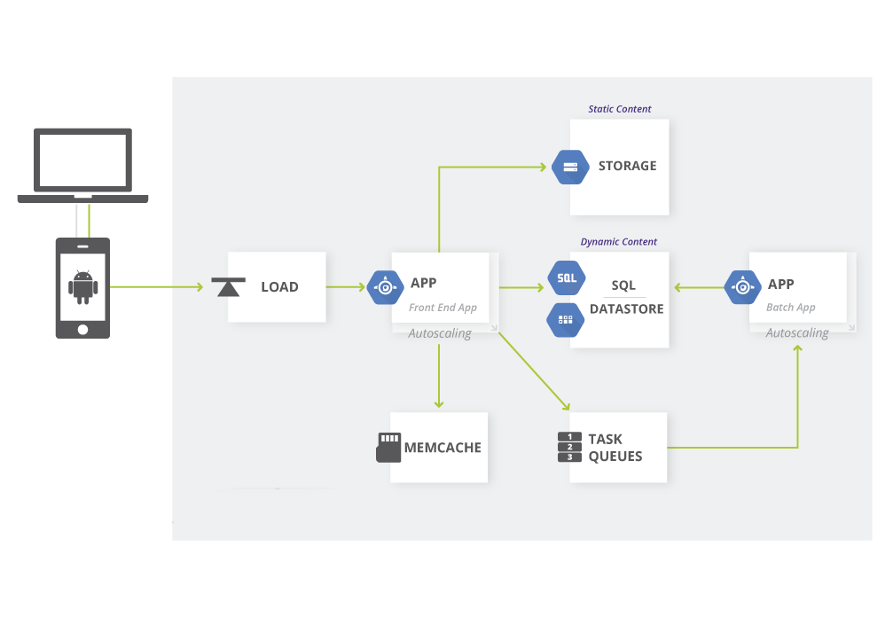

# 2. General Description

This section will give an overview of the whole system. The system will be explained in its context to show how the system interacts with other systems and introduce the basic functionality of it. It will also describe what type of stakeholders that will use the system and what functionality s avaliable for each type. At last, the constraints and assumptions for the system will be presented.

## 2.1 Product perspective

This system will consist of two parts: one mobile application and one web application. Both mobile and web application will share the same static and dynamic content as well as one shared SQL database. 

###### Figure 1. Architecture Block Diagram

As stated, both mobile and web application will used shared static and dynamic content and all the information distributed through the application will be stored in the same database. As presented in the Figure 1 above. All the load will be shared between mobile and web application. Information will be provided through the front end of the application by users and administrators. Application is scalable and autoscaling is used as responsiveness of the application to be displayed on all device sizes. 

The information is stored in shared SQL database. After the changes are made in the database itself through execusion of the task queries.
Task Queues provide a mechanism to offload longer running tasks to backend servers, freeing the front end servers to service new user requests. Application should provide real time content as fast as possible and as accurate as possible through communication with the database.

Memcache is an in-memory cache shared across the instances. This provides extremely high speed access to information cached by the web server (e.g. authentication or account information).

### 2.1.1 System Interface

System user can share details and information binded to his account and stored in the database through Internet connection.

### 2.1.2 User Interface

Screen format and list structure should be easily accessible to all users as well as easy to use. System must be user friendly and interactive.

All system fuctions should be avaliable for all system users.

### 2.1.3 Hardware Interface

System does not require any hardware support because it is located on the Network.

### 2.1.4 Software Interface

- Language: Java
- Frontend: JSP
- Backend: Spring Framework

### 2.1.5 Communication Interface

Users communicate through the Internet network.

### 2.1.6 Memory Requirements

The system requires the minimal ammount of RAM and HDD memory definied by its system requirements.

### 2.1.7 Operations

User sfirst have to register his user account by filling the registration form. System provides the interface for the account personalization (username, email and password changes) required for the user to log in. System has to provide the data backup in case of data loss.

## 2.2 Product Functions

With the application, the users will be able to create giveaways and receive ones. Users can create giveaways with the image of an item they want to gift to sameone as well as a description of the choosen item. Users who want to receive a giveaway from someone leave a comment under the presented giveaway and the choosen comment by the gift owner will get the item. 

Users can also search giveaways and users that are using the application. Users can see the News Feed that will provide all the content provided by the users they are following and Trending page where they will see all the trending giveaways currently happening.

The result of the search will be viewed either in a list view or in a profile view, depending on what criteria included in the search. The list view will have one list item for each giveaway matching the search criteria and show a small part of the giveaway information so the user can identify the searched giveaway. 

## 2.3 User Characteristics

There are three types of users that interact
with the system: users of the application, giveaway owners and administrators. Each of these three types of users 
has different use of the system so each of them has their own requirements.

The application users can only use the application to find giveaways and users and create and edit their own profile. They can also create giveaways and become gift owners. This means that the user have to be able to search for giveaways, choose a giveaway from that search and then navigate to it. In order for the users to get a relevant search result there are multiple criteria the users can specify and all results matches all of those.

The giveaway owners will also be able to use both mobile and web application. There they will manage the information about their giveaways, for example a description of the giveaway, contact information and their profile. They also can create new giveaways and search for one as well as search of the users of the application.

The administrators can also interact both with mobile and web application. They are managing the overall system so there is no incorrect information within it. The administrator can manage the information for each restaurant as well as the options for both the application users and the giveaway owners. 

## 2.4 Constraints

The application is constrained by the system interface to the navigation system within the application. Since there are multiple system manufacturers, the interface will likely not be the same for every one of them. Also, there may be a difference between what system features each of them provide.

The Internet connection is also a constraint for the application. Since the application fetches data from the database over the Internet, it is crucial that there is an Internet connection for the application to function. Both the web and the mobile application will be constrained by the capacity of the database. Since 
the database is shared between both application it may be forced to queue incoming requests and therefor increase the time it takes to fetch data.

## 2.5 Assumptions and Dependencies

One assumption about the product is that it will always be used on mobile phones that have enough performance. If the phone does not have enough hardware resources available for the application, for example the users might have allocated them with other applications, there may be scenarios where the application does not work as intended or even at all. 

Before the official release of the application there will be a list of minimal and recommended both hardware and software requirements.

## 2.6 Apportioning of Requirements

In the case that the project is delayed, there are some requirements that could be transferred to the next version of the application. 
