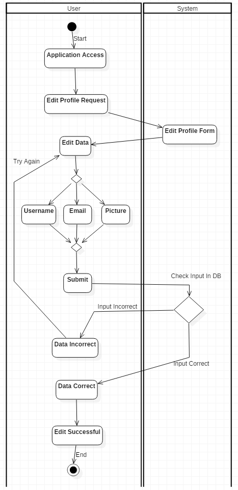

# 3. Specific Requirements

This section contains all of the functional and quality requirements of the system. It gives a detailed description of the system and all its features. 

## 3.1 External Interface Requirements

This section provides a detailed description of all inputs into and outputs from the system. It also gives a description of the hardware, software and communication interfaces and provides basic prototypes of the user interface.

### 3.1.1 System Interface

System users can share details and information bound to his account and stored in the database through an Internet connection.

### 3.1.2 User Interface

Screen format and list structure should be easily accessible to all users as well as easy to use. The system must be user friendly and interactive.

All system fuctions should be avaliable for all system users.

### 3.1.3 Hardware Interface

The system does not require any hardware support because it is located on the Network.

### 3.1.4 Software Interface

- Language: Java
- Frontend: JSP
- Backend: Spring Framework

### 3.1.5 Communication Interface

Users communicate through the Internet network.

### 3.1.6 Memory Requirements

The system requires the minimal ammount of RAM and HDD memory defined by its system requirements.

### 3.1.7 Operations

Users first have to register a user account by filling the registration form. The system provides the interface for the account personalization (username, email and password changes) required for the user to log in. The system has to provide the data backup in case of data loss.

## 3.2 Functional Requirements

| #   | Description                            | Code | Priority |
|-----|----------------------------------------|------|----------|
| 1.  | User can create their own account      | FR1  | High     |
| 2.  | User can log in                        | FR2  | High     |
| 3.  | User can log out                       | FR3  | High     |
| 4.  | User can edit their profile            | FR4  | Medium   |
| 5.  | User can edit their password           | FR5  | Medium   |
| 6.  | User can create giveaway               | FR6  | High     |
| 7.  | User can delete giveaway               | FR7  | Medium   |
| 8.  | User can comment on giveaways          | FR8  | High     |
| 9.  | User can delete comment on giveaways   | FR9  | Low      |
| 10. | User can choose the best comment       | FR10 | High     |
| 11. | User can send a message to other users | FR11 | High     |
| 12. | User can receive messages   		   | FR12 | High     |
| 13. | User can delete received messages      | FR13 | Low      |
| 14. | User can delete sent messages          | FR14 | Low      |
| 15. | User can upvote giveaways          	   | FR15 | Low      |
| 16. | User can rate users          		   | FR16 | Low      |
| 17. | User can follow users          		   | FR17 | Medium   |
| 18. | User can unfollow users        		   | FR18 | Medium   |
| 19. | User can see the list of followers     | FR19 | Low      |
| 20. | User can see the followed by list      | FR20 | Low      |
| 21. | User can see the news feed     		   | FR21 | High     |
| 22. | User can see the trending feed 		   | FR22 | High     |

## 3.3 Use Case Diagrams

### 3.3.1 User

### 3.3.2 Administrator

## 3.4 Non-fuctional Requirements

| #   | Description                            											  | Code  | Priority |
|-----|-----------------------------------------------------------------------------------|-------|----------|
| 1.  | Administrator has an unique account      										  | NFR1  | High     |
| 2.  | Only administrator can access database information                        		  | NFR2  | High     |
| 3.  | Only administrator can delete users from the database                       	  | NFR3  | High     |
| 4.  | Only administrator can delete giveaways from the databse            			  | NFR4  | High   	 |
| 5.  | System has to notify users 24h before the system update or scheduled maintenance  | NFR5  | High     |
| 6.  | User interface should have maximum four depth layers               				  | NFR6  | Medium   |
| 7.  | Administrator can only see admin panel         									  | NFR7  | High     |
| 8.  | Administrator can ban users   													  | NFR8  | Medium   |
| 9.  | Administrator can unban users       											  | NFR9  | Medium   |
| 10. | Administrator has to enter a reason for user ban 								  | NFR10 | Low      |
| 11. | User passwords should be hashed   												  | NFR11 | High     |
| 12. | Tokens are used for password reset   											  | NFR12 | High     |
| 13. | Only administrators can verify sponsors  										  | NFR13 | Medium   |
| 14. | Only administrators can ban posts   											  | NFR14 | Medium   |
| 15. | Only administrators can add new admins   										  | NFR15 | High     |
| 16. | Administrators can manage sponsors on trending page   							  | NFR16 | High     |

## 3.5 Activity Diagrams

### 3.5.1 Register

### 3.5.2 Log In

### 3.5.3 View

### 3.5.4 Edit

